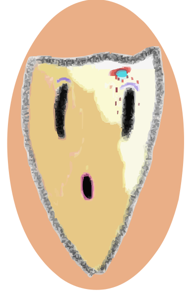

<header>
<link rel="stylesheet" type='text/css' href="https://cdn.jsdelivr.net/gh/devicons/devicon@latest/devicon.min.css" />
</header>

  <a href="https://github.com/Gama-Flomic11"><!-- Webpage when ready-->
  
  <h2 align="center">Gama-Flomic11</h2>
  </a>
  
Clicking and Clacking on Projects  

## About Me

- :heavy_plus_sign: :computer: Currently studying Mathematics and Computer Science at UNSW
- :new: to projects and the development space.
- :partly_sunny: Enjoying learning about algorithms and data structures and frontend design currently.
- Create issues and ask me anything [here](https://github.com/Gama-Flomic11/Gama-Flomic11/issues).

## Languages and Skills

    
    
    
    
    
    
    
    
    
    
    
    
    
  

## Additionally Uses

## Socials

## Sources

SVG images [here](https://devicon.dev/)

README stats and README inspiration [here](https://github.com/anuraghazra/github-readme-stats)

<!--
**Gama-Flomic11/Gama-Flomic11** is a ✨ _special_ ✨ repository because its `README.md` (this file) appears on your GitHub profile.

Here are some ideas to get you started:

- 🔭 I’m currently working on ...
- 🌱 I’m currently learning ...
- 👯 I’m looking to collaborate on ...
- 🤔 I’m looking for help with ...
- 💬 Ask me about ...
- 📫 How to reach me: ...
- 😄 Pronouns: ...
- ⚡ Fun fact: ...
-->
